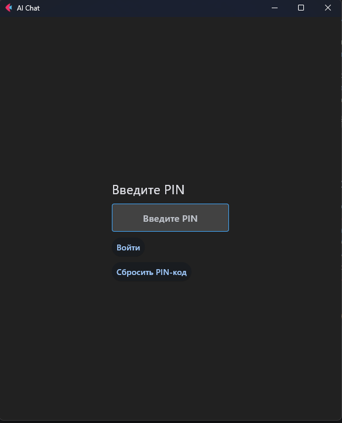

# <center>Flet AI Chat</center>

Кроссплатформенный чат-бот с поддержкой современных LLM (Large Language Models), написанный на Python с использованием фреймворка [Flet](https://flet.dev).

Приложение работает на **Android, Windows, Linux и macOS**. Оно предоставляет удобный интерфейс для общения с нейросетями через API OpenRouter, сохраняет историю переписки локально и умеет отправлять уведомления о генерации ответов.


---

<p align="center"><b>Окна авторизации</b></p>
<p align="center">
  
  
  
</p><br>

<p align="center"><b>Окна приложения</b></p>
<p align="center">
  
  
  
</p> <br>

---

## Возможности

* **🧠 Мультимодельность:** Поддержка множества моделей через OpenRouter (GPT-4o, Claude 3.5 Sonnet, DeepSeek, Llama 3 и др.) с возможностью поиска.
* **🔒 Безопасность:**
    * Вход по API-ключу.
    * Генерация 4ех значного PIN-кода для быстрого доступа.
    * Локальное хранение данных (SQLite), ничего не отправляется на сторонние серверы (кроме API нейросети).
* **💾 История и Экспорт:** Автоматическое сохранение диалогов и возможность экспорта переписки в JSON.
* **📊 Аналитика:** Встроенный мониторинг потраченных токенов, скорости ответа и использования моделей.
* **🔔 Уведомления:** Дублирование ответов нейросети на **Email** (SMTP) или в **Telegram** (через бота).
* **📈 Мониторинг:** Встроенный просмотр системных логов и метрик производительности (CPU/RAM).
* **🎨 Адаптивный UI:** Интерфейс подстраивается под экраны мобильных устройств и десктоп.

---

## Стек технологий

* **Язык:** Python 3.10+
* **UI Фреймворк:** Flet (Flutter wrapper)
* **База данных:** SQLite (хранение истории и авторизации)
* **API Клиент:** Requests + OpenRouter API
* **Асинхронность:** Asyncio (для UI и уведомлений)
* **Уведомления:** Aiogram (Telegram), SMTP (Email)

---

## Установка и запуск (для разработки)

### 1. Клонирование репозитория

```bash
git clone [https://github.com/denchicka/flet-ai-chat.git](https://github.com/denchicka/flet-ai-chat.git)
cd flet-ai-chat
```

### 2. Создание виртуального окружения

Рекомендуется использовать `venv` для изоляции зависимостей:

**Windows:**

```bash
python -m venv venv
venv\Scripts\activate
```

**macOS / Linux:**

```bash
python3 -m venv venv
source venv/bin/activate
```

### 3. Установка зависимостей

```bash
pip install -r requirements.txt
```

### 4. Настройка переменных окружения (опционально, так как используется окно авторизации)

Создайте файл `.env` в корне проекта (рядом с `main.py` и `requirements.txt`). Вы можете скопировать пример:

```bash
cp .env.example .env
```

**Пример содержимого `.env`:**

```ini
# Ключ OpenRouter (обязательно)
OPENROUTER_API_KEY=sk-or-v1-xxxxxxxxxxxxxxxxxxxx

# Базовый URL (обычно не меняется)
BASE_URL=[https://openrouter.ai/api/v1](https://openrouter.ai/api/v1)

# Настройки для дебага (опционально)
DEBUG=False

```

---

### 5. Запуск приложения

```bash
flet run src/main.py
```

---

## Сборка под Android (APK)

Для сборки мобильного приложения убедитесь, что у вас установлен [Flet CLI](https://flet.dev/docs/reference/cli/) и [Android SDK](https://developer.android.com/studio).

```bash
flet build apk
```

Готовый файл будет лежать в папке `build/apk`.

Далее выполните команду для перехода в папку `build/apk`:
```bash
cd build/apk
```

После этого подключите устройство к ПК по USB, включите режим разработчика и включите функцию "Отладка по USB".

Для установки на Android выполните команду:

```bash
adb install app-release.apk
```

---

## Структура проекта

```text
flet-ai-chat/
├── src/
│   ├── main.py              # Точка входа (async)
│   ├── chat_app.py          # Основная логика чата и UI
│   ├── auth_window.py       # Окна авторизации и PIN-кода
│   ├── auth_db.py           # БД для пользователей/пинов
│   ├── cache.py             # БД для истории чата
│   ├── openrouter.py        # Клиент API
│   ├── telegram.py          # Логика Telegram уведомлений
│   ├── email_notify.py      # Логика Email уведомлений
│   ├── analytics.py         # Сбор статистики
│   ├── monitor.py           # Мониторинг ресурсов
│   ├── logger.py            # Кастомный логгер
│   ├── styles.py            # Стили (CSS-like настройки)
│   └── components.py        # UI компоненты (пузырьки чата, дропдауны)
├── logs/                    # Папка с логами (создается автоматически)
├── exports/                 # Папка для экспорта чатов
├── requirements.txt         # Зависимости
├── .gitignore               # Исключения Git
└── README.md                # Этот файл

```

---

## Вклад в проект (Contributing)

Если вы хотите улучшить проект:

1. Форкните репозиторий.
2. Создайте ветку для новой функции (`git checkout -b feature/AmazingFeature`).
3. Закоммитьте изменения (`git commit -m 'Add some AmazingFeature'`).
4. Запушьте ветку (`git push origin feature/AmazingFeature`).
5. Откройте Pull Request.

---

## Возможные улучшения

Возможные направления развития:

- Хеширование паролей и токенов в БД, используя `SHA256`.

---

## Лицензия

Лицензия: MIT.

---

## Обратная связь

Если у вас есть пожелания или вопросы, Вы можете связаться в личных сообщениях в мессенджере [Telegram](t.me/denchicka213)

